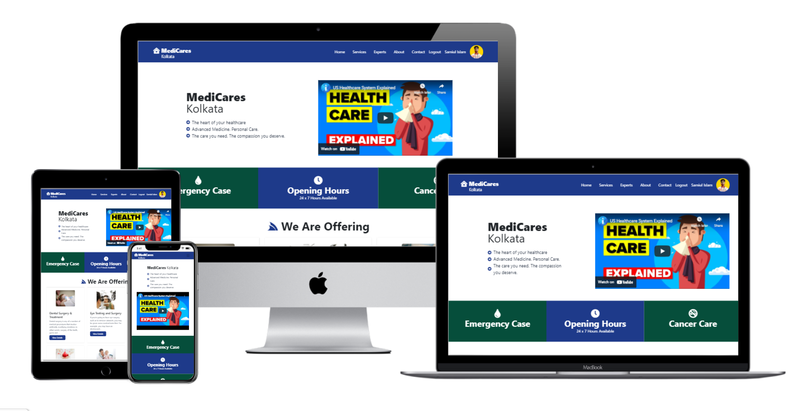

## MediCares (Kolkata)

##### Project live link: https://medi-cares.web.app/

##### Project Code link: https://github.com/Programming-Hero-Web-Course3/healthcare-related-website-softsamiul

##### Project Mockup

##### Used Technologies:

- `React`
- `React Router Dom`
- `React Hook Form`
- `React Bootstrap`
- `TailWind CSS`
- `Firebase`

#### Features:

- `Anyone can check our website to get therir desired health services`
- `Implemented user account create & login system`
- `Worked on Firebase Authentication`
